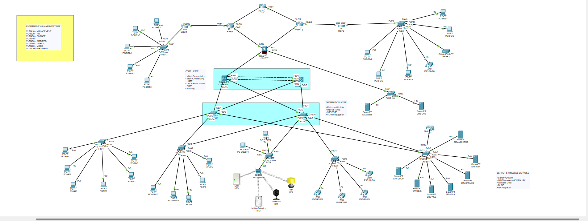

# Secure-MultiSite-Enterprise-Network

> **Designing, Configuring and Validating a Scalable Multi-Layer Enterprise Network using Cisco Packet Tracer**



## 📌 Project Overview

This project presents a **multi-layer enterprise network infrastructure** designed and implemented using **Cisco Packet Tracer**.

The network was developed to simulate a realistic enterprise environment with centralized services, redundant Layer 3 switching, VLAN segmentation, inter-VLAN routing, first-hop redundancy, spanning-tree optimization, trunk links, EtherChannel, wireless infrastructure, servers, and branch connectivity.

The project was built incrementally, starting from the core switching infrastructure and expanding toward distribution, access, server, wireless, and WAN/branch connectivity.

---

## 🏗️ Network Architecture

The overall topology follows a hierarchical enterprise network design:

```text
                         ┌───────────────┐
                         │     ISP/RISP  │
                         └───────┬───────┘
                                 │
                    ┌────────────┴────────────┐
                    │                         │
                 RHQ1                       RHQ2
                    │                         │
                 RBR1                       RBR2
                    │                         │
              ┌─────┴─────────────────────────┴─────┐
              │                                      │
          CORE-SW1 ============================ CORE-SW2
              │                                      │
              ├──────────── Distribution Layer ──────┤
              │                                      │
          DISTSW1                                 DISTSW2
              │                                      │
              └──────────── Access Layer ────────────┘
                                      │
                                ACCESS SWITCHES
                                      │
                         ┌────────────┴────────────┐
                         │                         │
                      SERVERS                     WLC
                         │                         │
                    VLAN 50                  Wireless Network
```

> The diagram above is a simplified logical representation. The actual Packet Tracer topology is available in the topology screenshot above.

---

## 🔧 Technologies & Networking Concepts

The project implements the following networking technologies:

* VLAN segmentation
* Inter-VLAN routing
* Layer 3 switching
* HSRP first-hop redundancy
* RSTP / Spanning Tree Protocol
* 802.1Q trunking
* EtherChannel
* LACP
* Access and distribution layer switching
* Server network segmentation
* Wireless LAN Controller (WLC)
* DHCP services
* Network management VLAN
* Voice VLAN
* Guest network segmentation
* WAN / branch connectivity
* Cisco Discovery Protocol (CDP)
* MAC address learning and verification
* Network troubleshooting and validation

---

## 🏷️ VLAN Architecture

| VLAN ID | VLAN Name  | Purpose                           | Network          |
| ------: | ---------- | --------------------------------- | ---------------- |
|      10 | MANAGEMENT | Network/device management         | `172.16.10.0/24` |
|      20 | HR         | Human Resources                   | `172.16.20.0/24` |
|      30 | FINANCE    | Finance department                | `172.16.30.0/24` |
|      40 | IT         | IT department                     | `172.16.40.0/24` |
|      50 | SERVERS    | Enterprise servers                | `172.16.50.0/24` |
|      60 | GUEST      | Guest users                       | `172.16.60.0/24` |
|      70 | VOICE      | Voice/VoIP network                | `172.16.70.0/24` |
|     100 | NET-MGMT   | Network infrastructure management | `10.10.100.0/24` |

---

## 🔄 Core Switching

The core layer consists of two multilayer switches:

* **CORE-SW1**
* **CORE-SW2**

The core switches provide:

* Layer 3 SVIs
* Inter-VLAN routing
* HSRP gateway redundancy
* VLAN trunking
* EtherChannel
* RSTP
* Redundant paths toward the distribution layer

### HSRP

HSRP was implemented to provide redundant default gateways for the VLANs.

|     VLAN | Virtual Gateway |
| -------: | --------------- |
|  VLAN 10 | `172.16.10.1`   |
|  VLAN 20 | `172.16.20.1`   |
|  VLAN 30 | `172.16.30.1`   |
|  VLAN 40 | `172.16.40.1`   |
|  VLAN 50 | `172.16.50.1`   |
|  VLAN 60 | `172.16.60.1`   |
|  VLAN 70 | `172.16.70.1`   |
| VLAN 100 | `10.10.100.1`   |

HSRP provides a virtual gateway address so hosts can continue using the same default gateway when the active core gateway changes.

---

## 🔗 EtherChannel

An EtherChannel bundle was configured between the core switches using **LACP**.

### Port-Channel

```text
CORE-SW1
   │
   │ Fa0/2
   │ Fa0/3
   │
   ║
   ║  Port-Channel1
   ║  LACP
   ║
   │
   │ Fa0/2
   │ Fa0/3
   │
CORE-SW2
```

The EtherChannel provides:

* Link redundancy
* Increased aggregate bandwidth
* Reduced dependency on a single physical link
* Improved resilience between the core switches

---

## 🌳 Spanning Tree

**RSTP** was used to control Layer 2 loops and provide redundant-path protection.

The project includes redundant links between:

* CORE-SW1
* CORE-SW2
* DISTSW1
* DISTSW2
* Access switches

Spanning Tree dynamically determines forwarding and blocking paths.

For example, VLAN 70 was verified using:

```text
show spanning-tree vlan 70
```

The topology therefore maintains redundant physical paths while preventing Layer 2 loops.

---

## 🔌 Distribution Layer

The distribution layer connects the core switches to the access layer.

Core-to-distribution connections include:

```text
CORE-SW1 Fa0/5 → DISTSW1
CORE-SW1 Fa0/6 → DISTSW2

CORE-SW2 Fa0/5 → DISTSW2
CORE-SW2 Fa0/6 → DISTSW1
```

This creates redundant paths between the core and distribution layers.

---

## 🖥️ Server Network

The dedicated server switch provides connectivity to the server VLAN and wireless infrastructure.

### Server Switch

```text
Fa0/1 → DISTSW1
Fa0/2 → DISTSW2

Fa0/3 – Fa0/9 → Servers

Fa0/10 → WLC
```

Server-facing ports were assigned to:

```text
VLAN 50 - SERVERS
```

The WLC uplink was configured as a trunk with the required enterprise VLANs.

---

## 📡 Wireless Infrastructure

A Cisco Wireless LAN Controller was integrated into the enterprise network.

The WLC is connected through the server switch:

```text
SERVER-SW
   │
   └── Fa0/10
         │
         ▼
        WLC
```

The WLC provides centralized wireless network management and supports wireless connectivity within the enterprise topology.

---

## 🌐 WAN & Branch Connectivity

The project also includes a WAN/branch section.

### Router hierarchy

```text
             RISP
            /    \
          RHQ1  RHQ2
           |      |
         RBR1   RBR2
```

The WAN section was configured to provide connectivity between the central enterprise environment and branch networks.

Connectivity and routing were validated using commands such as:

```text
show ip interface brief
show ip route
show cdp neighbors
```

---

## 🔐 Network Segmentation

The network was divided into separate VLANs according to organizational requirements.

### Departmental segmentation

```text
VLAN 10 → MANAGEMENT
VLAN 20 → HR
VLAN 30 → FINANCE
VLAN 40 → IT
VLAN 50 → SERVERS
VLAN 60 → GUEST
VLAN 70 → VOICE
VLAN 100 → NET-MGMT
```

This segmentation reduces unnecessary Layer 2 communication and provides a structured foundation for applying security policies and access controls.

---

## 🧪 Verification & Troubleshooting

Throughout the implementation, the network was continuously verified using Cisco IOS commands.

### VLAN verification

```text
show vlan brief
show vlan id 50
show vlan id 70
show vlan id 100
```

### Trunk verification

```text
show interfaces trunk
show interfaces fa0/5 switchport
show interfaces fa0/6 switchport
show interfaces fa0/10 switchport
```

### STP verification

```text
show spanning-tree vlan 50
show spanning-tree vlan 70
```

### HSRP verification

```text
show standby brief
```

### EtherChannel verification

```text
show etherchannel summary
```

### Neighbor discovery

```text
show cdp neighbors
```

### Interface verification

```text
show ip interface brief
show interfaces status
```

### MAC address verification

```text
show mac address-table dynamic
```

These commands were used to identify trunking problems, VLAN inconsistencies, STP forwarding/blocking states, interface status issues, and connectivity problems during implementation.

---

---

## 🎯 Project Objectives

* Design a scalable enterprise network architecture
* Implement VLAN-based network segmentation
* Configure Layer 3 switching
* Provide redundant default gateways using HSRP
* Implement redundant Layer 2 paths
* Configure EtherChannel using LACP
* Implement RSTP for loop prevention
* Integrate centralized wireless infrastructure
* Provide a dedicated server network
* Implement WAN and branch connectivity
* Validate network operation using Cisco IOS verification commands
* Troubleshoot real configuration and connectivity issues

---

## 📚 Skills Demonstrated

### Networking

* Enterprise Network Design
* VLANs
* Inter-VLAN Routing
* 802.1Q Trunking
* HSRP
* RSTP
* EtherChannel
* LACP
* DHCP
* WAN Connectivity
* Wireless Networking

### Cisco IOS

* Interface configuration
* VLAN configuration
* SVI configuration
* Trunk configuration
* Redundancy configuration
* Routing verification
* STP troubleshooting
* CDP
* MAC table analysis
* Network troubleshooting

### Troubleshooting

The project involved practical troubleshooting of:

* Trunk inconsistencies
* STP forwarding/blocking states
* VLAN propagation
* SVI status
* HSRP state changes
* Redundant paths
* Interface connectivity
* Wireless uplink configuration

---

## 🏁 Final Outcome

The completed Packet Tracer environment represents a **multi-layer enterprise network** with redundant core infrastructure, segmented departments, server services, centralized wireless infrastructure, distribution/access switching, and WAN/branch connectivity.

The project demonstrates the practical application of enterprise networking concepts through configuration, verification, troubleshooting, and documentation.

---

## 🛠️ Tools Used

* Cisco Packet Tracer
* Cisco IOS
* Ethernet / FastEthernet / GigabitEthernet
* Cisco Multilayer Switches
* Cisco Layer 2 Switches
* Cisco Routers
* Wireless LAN Controller
* Enterprise Servers

---

## 👩‍💻 Author

**Sanduni Dilrukshika**

ICT Undergraduate | Network Technology


## 📌 Note

This project was developed as a Cisco Packet Tracer-based enterprise networking project for practical learning, network design, configuration, verification, and portfolio development.

